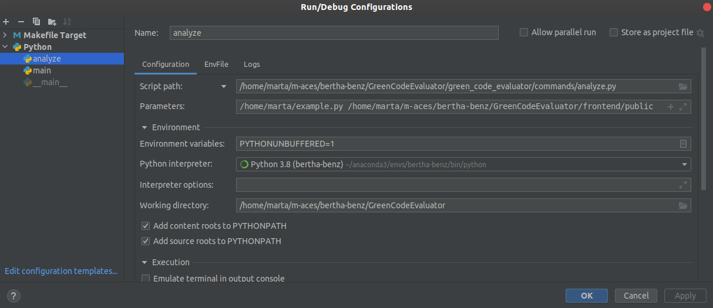

# Running instructions 

While developing you may want to run the code for testing or debugging purposes. This page aims to show you three ways to do so. 

## Through the terminal

Simply run 
```commandline
python green_code_evaluator/commands/analyze.py /home/marta/example.py /home/marta/results
```

## PyCharm

Make sure you have GreenCodeEvaluator as your source code (right click GreenCodeEvaluator > Mark Directory as > Sources Root)  
Add a new configuration like the following:  

</img>

You can change the parameters to suit your input and output paths.  

This way you should be able to run or debug the code on PyCharm.

## VSCode

I usually use the debug option because you can pass arguments in the `launch.json` file.  

When clicking on the debug option on the left, click on Run and debug, then select create a new launch file and choose Python file. Add the following configuration:
```json
{
    // Use IntelliSense to learn about possible attributes.
    // Hover to view descriptions of existing attributes.
    // For more information, visit: https://go.microsoft.com/fwlink/?linkid=830387
    "version": "0.2.0",
    "configurations": [
        {
            "name": "run analyze",
            "type": "python",
            "request": "launch",
            "program": "${file}",
            "console": "integratedTerminal", 
            "args": [
                "/home/marta/example.py", "/home/marta/results"
            ],
            "cwd": "/home/marta/m-aces/bertha-benz/GreenCodeEvaluator"
        }
    ]
}
```

You can change the parameters to suit your input and output paths. Now you should be able to run or debug the code on VSCode.

